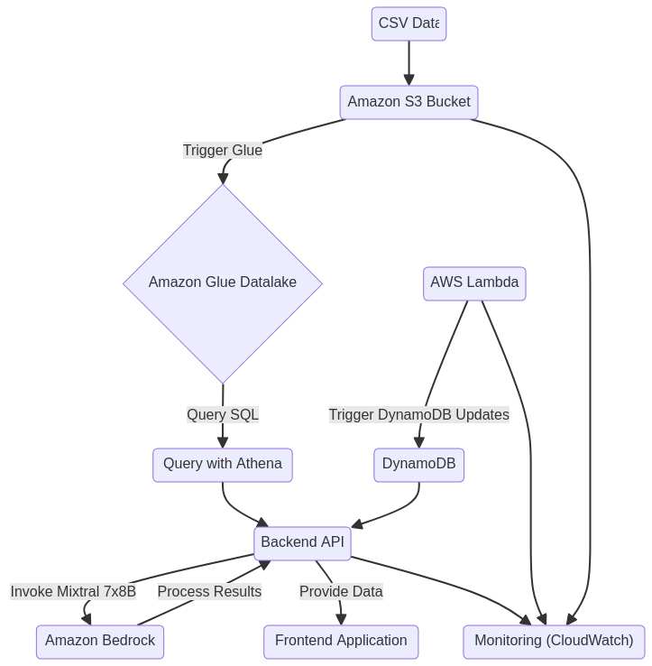

# Atlas Project – GenAI

This repository contains a complete web project, composed of a backend (REST API built on Fastify & Prisma) and a frontend (React + Vite). It also includes GitHub workflows for continuous integration and deployment, as well as a configuration for Docker. The goal is to provide a functional foundation for developing web applications, with a clear separation between front and back, and a complete toolset (tests, init scripts, linting, etc.).

## Table of contents

1. [Project overview](#project-overview)  
2. [General directory structure](#general-directory-structure)  
3. [Prerequisites](#prerequisites)  
4. [Installation and configuration](#installation-and-configuration)
   - [Environment variables configuration](#environment-variables-configuration)
5. [Launch the project](#launch-the-project)
   - [Launch the backend](#launch-the-backend)
   - [Launch the frontend](#launch-the-frontend)
   - [Using Docker](#using-docker)
6. [Useful scripts](#useful-scripts)
7. [CI/CD – GitHub Workflows](#cicd--github-workflows)
8. [Contributing](#contributing)
9. [License](#license)

---

## 1. Project overview

- **Backend**:  
  - Based on [Fastify](https://www.fastify.io/) and [Prisma](https://www.prisma.io/) (with PostgreSQL).  
  - Handles JWT authentication, pagination, CORS/Helmet configuration, a centralized error management system and integrated Swagger documentation.  
  - Possible deployment via Docker and Docker Compose, or [Serverless](https://www.serverless.com/) (AWS Lambda for example).

- **Frontend**:  
  - Developed in [React](https://reactjs.org/) + [Vite](https://vitejs.dev/).  
  - Includes a real-time chat example, navigation management with React Router, a WebSocket Chat system, as well as some interface components (Sidebar, Layout Dashboard, etc.).  
  - Configured with ESLint, Prettier, TypeScript, etc.  
  - Designed to be deployed on static hosting (or via Serverless Finch / CloudFront-S3).

- **GitHub Workflows**:  
  - *ci-frontend.yml*: Executes frontend CI, with installation, tests, build, etc.  
  - *cd-frontend-deployment.yml*: Continuous deployment of the frontend to a defined environment (S3, etc.).

---

## 2. General directory structure

```
redboarddev-atlas-genai/
├── README.md                 # (this file)
├── backend/
│   ├── Dockerfile
│   ├── docker-compose.yml
│   ├── package.json
│   ├── serverless.yml
│   ├── tsconfig.json
│   ├── app/
│   │   ├── app.ts            # Fastify entry point
│   │   ├── env/
│   │   │   └── .env_example
│   │   └── src/
│   │       ├── routes/
│   │       ├── services/
│   │       ├── middlewares/
│   │       ├── libs/
│   │       ├── entities/
│   │       ├── config/
│   │       └── ...
│   ├── prisma/
│   │   ├── schema.prisma
│   │   └── .env_example
│   └── usefull-scripts/
│       ├── generate-local.sh
│       ├── init-docker.sh
│       ├── migrate-local.sh
│       ├── start-docker.sh
│       └── stop_docker.sh
├── frontend/
│   ├── Dockerfile
│   ├── vite.config.ts
│   ├── package.json
│   ├── public/
│   │   └── locales/
│   └── src/
│       ├── App.tsx
│       ├── components/
│       ├── services/
│       ├── routes/
│       └── ...
└── .github/
    └── workflows/
        ├── ci-frontend.yml
        └── cd-frontend-deployment.yml
```

---

## 3. Prerequisites

To use this project locally or run CI/CD, you will need the following elements:

- **Node.js** ≥ 18.x  
- **npm** ≥ 8.x (provided with Node.js), or **yarn**  
- **Docker** ≥ 20.10 (if you use Docker)  
- **Docker Compose** ≥ 1.29 (for the backend's docker-compose.yml)  
- **Serverless CLI** (optional, if you plan to deploy on AWS Lambda)  
  ```bash
  npm install -g serverless
  ```

---

## 4. Installation and configuration

1. **Clone the repository**  

   ```bash
   git clone https://github.com/your-username/redboarddev-atlas-genai.git
   cd redboarddev-atlas-genai
   ```

2. **Install dependencies**  
   - For the backend:
     ```bash
     cd backend
     npm install
     ```
   - For the frontend:
     ```bash
     cd ../frontend
     npm install
     ```

### Environment variables configuration

- **Backend**  
  - In `backend/app/env/.env_example`, you will find an example of the necessary variables configuration (API_PORT, POSTGRES_USER, POSTGRES_PASSWORD, etc.).  
  - Copy the file to `.env` and adapt it to your environment:

    ```bash
    cp backend/app/env/.env_example backend/app/env/.env
    ```

  - Do the same for `prisma/.env_example` if necessary (DATABASE_URL, etc.).

- **Frontend**  
  - There may be an equivalent `.env` to define the API URL, etc.  
  - Refer to `frontend/config/stages-urls.json` or `editApiUrl.js` if you want to customize URLs based on the environment.

---

## 5. Launch the project

### Launch the backend

You can launch the backend either directly locally (Node.js) or via Docker.

#### Locally (Node.js)

1. Go to the `backend` folder.
2. Make sure your database is accessible (via docker or a local service).
3. Execute:
   ```bash
   npm run dev
   ```
4. The API is normally accessible at [http://localhost:3000](http://localhost:3000) (or the port configured in your `.env`).

#### Launch the frontend

In the `frontend` folder:

1. Start the development server:
   ```bash
   npm run dev
   ```
2. Then access the URL provided in the console (often [http://localhost:5173](http://localhost:5173)).

### Using Docker

The project can also be launched via Docker Compose for the backend. The scripts are located in `backend/usefull-scripts`.

1. **Start containers** (backend + DB):
   ```bash
   cd backend
   ./usefull-scripts/start-docker.sh
   ```
2. **Initialize the database** (migrations, seed):
   ```bash
   ./usefull-scripts/init-docker.sh
   ```
3. **Verify**: the API should respond on the `API_PORT` defined in your `.env`.  
4. The frontend can also be containerized (Dockerfile in `frontend`), according to your usual workflow. A unified `docker-compose` example could be added if needed.

---

## 6. Useful scripts

- **Backend**:  
  - `npm run dev`: starts the Fastify server in development mode (watch).  
  - `npm run prisma:generate`: generates the Prisma client.  
  - `npm run prisma:migrate`: applies migrations in dev mode.  
  - `npm run prisma:seed`: runs the seed script.  
  - `npm run lint:check` / `lint:fix`: checks / fixes code via ESLint.  
  - `npm run format:check` / `format:fix`: checks / formats via Prettier.  

- **Frontend**:  
  - `npm run dev`: launches Vite in dev mode.  
  - `npm run build`: builds the application for production.  
  - `npm run preview`: previews the build.  

- **Docker Scripts (backend/usefull-scripts)**:  
  - `start-docker.sh`: launches Docker Compose (API + Postgres).  
  - `stop_docker.sh`: stops and removes containers.  
  - `init-docker.sh`: generates the Prisma client, runs migrations and seed.  
  - `generate-local.sh`, `migrate-local.sh`: utilities to generate the Prisma client and run migrations locally.

---


